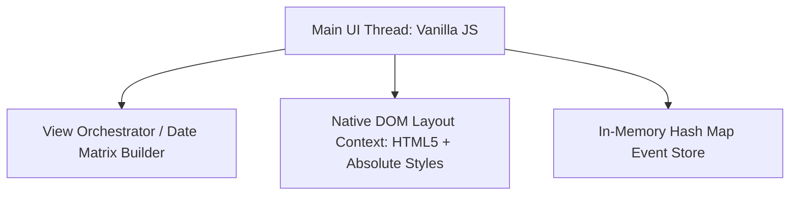

If we shift away from chronological stacking and implement **absolute positioning** for overlapping events, we can no longer rely on standard HTML block or flex layout flows. Instead, our `DOM Template Orchestrator` must mathematically map each event's execution duration to explicit, bounding-box top and height pixel offsets.

Because we are doing this **without complex layout virtualization, graph coloring algorithms, or multi-calendar tracking**, we can execute this by building a localized, single-day columns packing loop using standard CSS absolute placement properties.

Here is the updated system design plan optimized for absolute coordinate positioning.

---

## 1. Requirements

### 1.1. Functional Requirements

* **Standard View Layouts:** Toggle between Day, Week, and Month views utilizing raw CSS Grid layout containers.
* **Basic Event Management:** Create, view, and delete events via native HTML5 interactive modal dialog popups.
* **Absolute Visual Positioning:** Mathematically calculate and apply exact `top` and `height` CSS style rules matching event time vectors.
* **Horizontal Column Split Overlaps:** Automatically split columns horizontally next to each other using absolute `left` and `width` coordinates when collision windows are detected.
* **Multi-Day Event Tracking:** Render continuous event bars across day cells in Month View, and map them to an isolated "All-Day" top pocket in Day/Week views.

### 1.2. Non-Functional Requirements

* **Sub-100ms View State Transitions:** Swapping between views or navigating months must update the layout instantly without visual lag.
* **Zero-Liability Memory Model:** Rely on native JavaScript object references to safely map multi-day events across boundaries without multiplying RAM usage.

---

## 2. Tech-Stack



* **Core Scripting Engine:** Vanilla ES6+ JavaScript. Eliminates framework bundle size penalties and virtual-DOM diffing overhead.
* **Layout Mechanics:** Standard HTML5 elements structured using an **Absolutely Positioned Grid Context** (`position: relative` containers on hourly timelines, housing `position: absolute` event blocks).
* **State Storage Matrix:** A native JavaScript `Map` object, optimized for constant-time ($O(1)$) lookups matching a string date key template.

---

## 3. Component Architecture

### 3.a. Component Hierarchy

```
CalendarApplicationContainer
 ├── NavigationHeader (Today Button, Prev/Next Navigation Controls, View Selector Dropdown)
 └── ViewWorkspace Shell
        ├── DayView (Vertical relative timeline grid + Top All-Day Pocket Flexbox)
        ├── WeekView (7-Column relative hour layout + Top All-Day Pocket Flexbox)
        └── MonthView (7-Column by 5/6 Row uniform CSS Grid day cell matrix)

```

---

## 4. Data Models

### 4.a. Data Model / State Model

#### 1. Core Event Schema

Events are stored using clean, readable ISO-8601 strings, keeping them easy to parse natively.

```typescript
interface CalendarEvent {
  id: string;
  title: string;
  description?: string;
  startIso: string;   // e.g., "2026-06-15T10:00:00"
  endIso: string;     // e.g., "2026-06-15T11:30:00"
  isMultiDay: boolean; // Flag evaluated on creation if duration spans across midnight
}

type EventStore = Map<string, CalendarEvent[]>; 

```

---

## 5. Performance & Optimization

### 5.a. Absolute Geometric Coordinate Mapping Algorithm

For Day and Week views, time is mapped to a static vertical axis layout where **1 hour = $X$ pixels** (e.g., `60px`, meaning 1 minute = `1px`). To determine absolute placement coordinates without complex background worker thread engines, the frontend executes a localized **Interval Splitting Loop** during the DOM compiling pass:

1. **Calculate Verticals (`top` / `height`):**
* Parse `startIso` to find total minutes past midnight. $\text{CSS top} = \text{minutes} \times 1\text{px}$.
* Calculate difference between end and start times in minutes. $\text{CSS height} = \text{duration minutes} \times 1\text{px}$.


2. **Calculate Horizontals (`left` / `width`) via Collision Checks:**
* Sort the isolated day array chronologically.
* Loop through the events to group colliding rows into single concurrent blocks (clusters).
* Inside each cluster, assign events to column tracks. If a cluster requires a maximum of $N$ columns, every event in that group gets an absolute style constraint:

$$\text{CSS width} = \frac{100\%}{N}$$


$$\text{CSS left} = \text{ColumnIndex} \times \left(\frac{100\%}{N}\right)$$


### 5.b. Pointer Duplication for Multi-Day Events

Instead of creating heavy layout tracking duplicates, an event spanning across multiple days drops its **object memory pointer reference** into every matching daily map key it spans across.

If it is multi-day, the rendering engine completely bypasses calculating hourly timeline positions. It routes it straight into the top flex header pocket (`All-Day Pocket`), leaving the absolute timeline completely clean and readable.

### 5.c. DocumentFragment Batch Injection

The template orchestrator creates layout elements inside an offline `DocumentFragment` node in memory first, appending it to the active view page in a single efficient step. This minimizes script layout thrashing while applying hundreds of distinct absolute position styles.

---

## 6. Accessibility (A11y)

* **DOM Order Preservation:** Even though events are shifted around visually on the screen using absolute CSS coordinates, the template engine ensures the HTML elements remain written inside the DOM in chronological order. This ensures keyboard `Tab` selection flows natively matching actual time intervals.
* **Focus-Trapped Modal Interfaces:** The creation popup uses the browser's native HTML5 `<dialog>` element. Triggering `.showModal()` automatically restrains keyboard navigation tab actions inside the popup form container and allows instant closure by pressing the `Escape` key.

---

## 7. Adaptability

### 7.a. Base-Unit Layout Zooming

Because positioning positions rely entirely on a single multiplier constant (e.g., `1 minute = 1px`), increasing or decreasing text layout scale amounts to modifying a single root pixel value variable.

### 7.b. Grid Layout Fluidity via Relative Widths

Because horizontal offsets are compiled as percentage bounds (`width: 33.33%`, `left: 66.66%`), the absolute blocks scale fluidly automatically when users expand or compress browser windows, allowing the layout to run smoothly on desktop grids without breaking element containers.