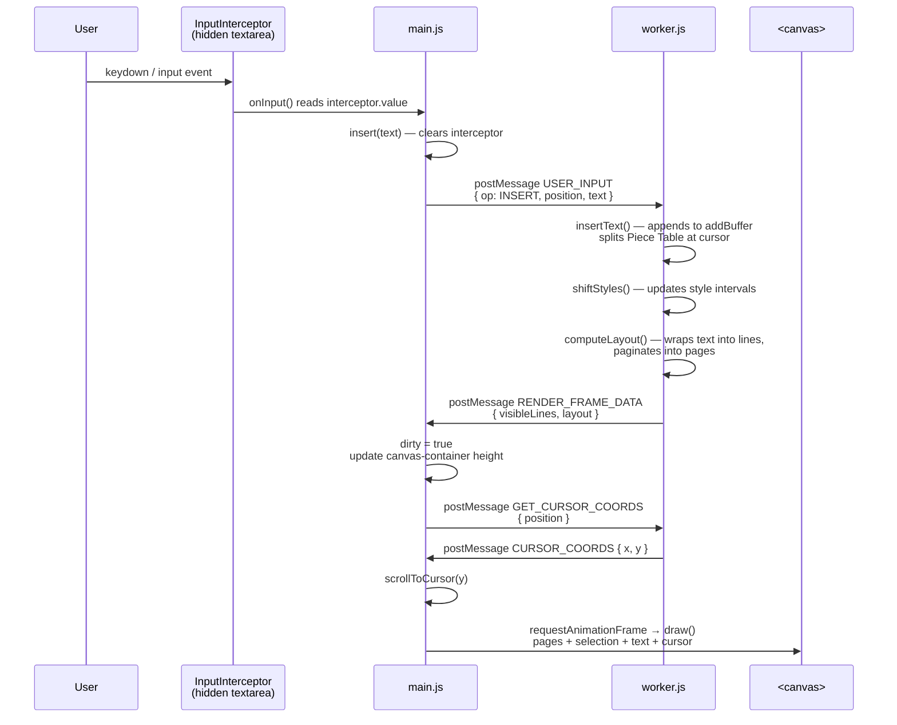
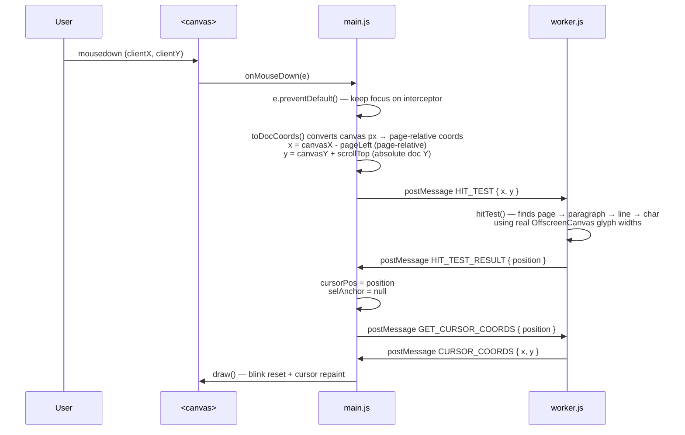
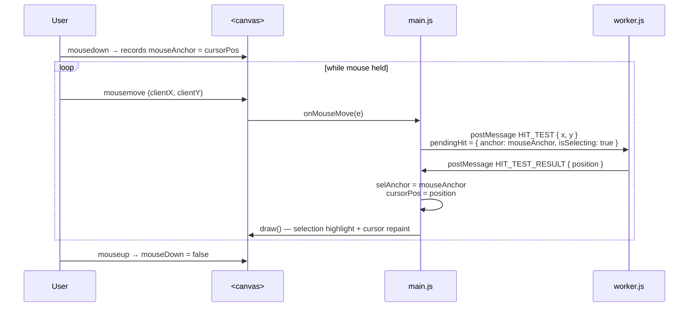
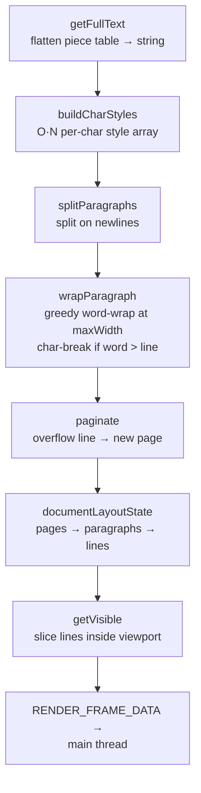
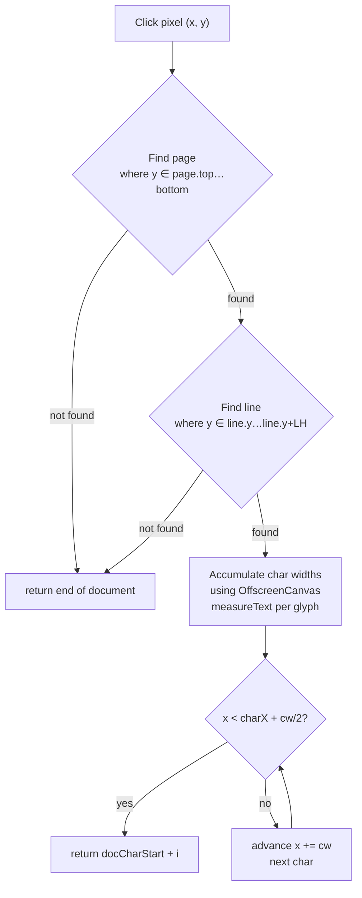
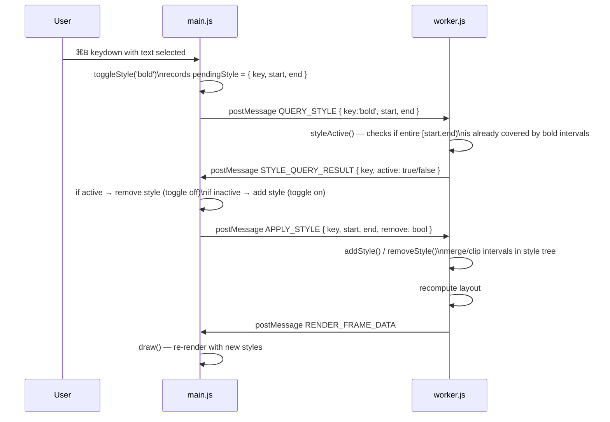

# Canvas Docs — Rich Text Editor

A Google Docs-inspired rich-text editor built entirely from scratch using **HTML5 Canvas**, **Web Workers**, and a **Piece Table** buffer. No frameworks, no libraries — just vanilla JavaScript following a strict frontend system design.

---

## Architecture Overview

```
┌─────────────────────────────────────────────────────────────┐
│                        Browser Tab                          │
│                                                             │
│  ┌─────────────┐      postMessage       ┌────────────────┐  │
│  │  Main Thread │ ───────────────────► │  Web Worker    │  │
│  │  (main.js)   │ ◄─────────────────── │  (worker.js)   │  │
│  └─────────────┘      postMessage       └────────────────┘  │
│         │                                      │            │
│    draw() via                           Piece Table +        │
│    rAF loop                             Layout Engine        │
│         │                                                    │
│  ┌──────▼──────┐                                            │
│  │ <canvas>    │   ← all rendering happens here             │
│  │ #doc-canvas │                                            │
│  └─────────────┘                                            │
│                                                             │
│  ┌─────────────┐                                            │
│  │ <textarea>  │   ← hidden; holds real keyboard focus      │
│  │ #interceptor│                                            │
│  └─────────────┘                                            │
└─────────────────────────────────────────────────────────────┘
```

---

## Data Flow Diagrams

### 1. User Types a Character



---

### 2. User Clicks to Place Cursor



---

### 3. User Drags to Select Text



---

### 4. Piece Table — Insert Operation

```
Before insert at position 7:
  originalBuffer: "Hello, World!"
  addBuffer:      ""
  pieces:         [ { src:'o', start:0, length:13 } ]

After insert("!") at position 7:
  originalBuffer: "Hello, World!"
  addBuffer:      "!"
  pieces:         [
    { src:'o', start:0, length:7  },   ← "Hello, "
    { src:'a', start:0, length:1  },   ← "!"
    { src:'o', start:7, length:6  },   ← "World!"
  ]
```

> The original buffer is **never modified**. All edits append to `addBuffer`
> and restructure the piece list — keeping every undo snapshot cheap (just a
> copy of the piece array, not the full text).

---

### 5. Layout Engine Pipeline



---

### 6. Hit Test — Click to Character



---

### 7. Style Toggle Flow (⌘B Bold)



---

## File Structure

```
googleDocs/
├── index.html    — Shell: scroll-viewport, hidden interceptor, canvas
├── style.css     — Minimal: viewport + scrollbar + sticky canvas
├── main.js       — UI controller: render loop, input, worker gateway
└── worker.js     — Engine: Piece Table, Style Tree, Layout, Hit Test
```

## Key Design Decisions

| Decision | Rationale |
|---|---|
| **Piece Table** over array buffer | O(log N) insert/delete; undo snapshots are cheap (just copy the piece list, not the text) |
| **Web Worker** for layout | Layout is CPU-intensive (measure every glyph); running it off the main thread keeps the render loop at 60 FPS |
| **OffscreenCanvas** in worker | Gives the worker real `measureText()` so hit-test and cursor pixel positions are exact — consistent with the main thread renderer |
| **Hidden `<textarea>` interceptor** | Canvas has no native text input; the textarea holds focus and captures IME, paste, and all key events without us re-implementing the browser's keyboard handling |
| **Sticky canvas + tall container** | The canvas `position:sticky` always fills the viewport; a tall `#canvas-container` drives the native scrollbar so we get free scroll physics |
| **`e.preventDefault()` on mousedown** | Without this the browser moves focus from the textarea to the canvas on every click, breaking subsequent typing |
