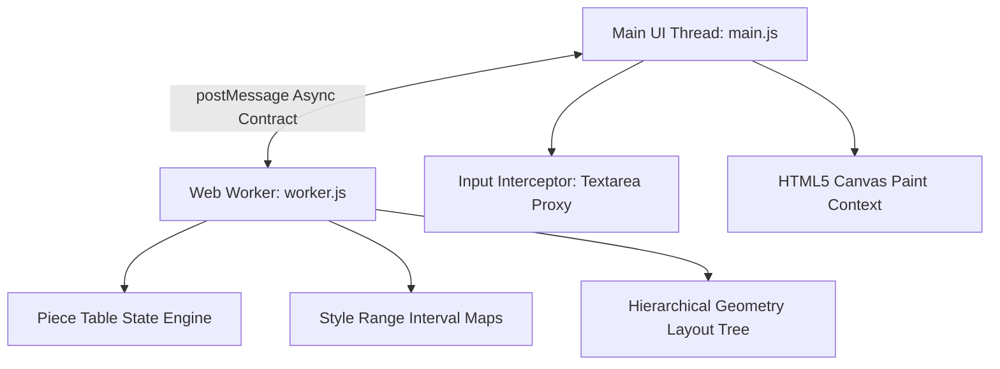

Here is the complete, comprehensive Frontend System Design plan based explicitly on the architecture, data models, and algorithms implemented in the code files you provided, alongside our architectural discussions today.

---

## 1. Requirements

### 1.1. Functional Requirements

* **Rich Text Editing:** Instant text insertion, deletion, caret navigation, keyboard selection modifications, and line breaks handled via an invisible input interceptor proxy.
* **Inline Styling:** Typographic treatments including Bold, Italic, Underline, and custom font configurations applied dynamically over targeted index intervals.
* **Paragraph Alignment:** Layout block formatting adjusting the layout axis calculations for Left, Center, and Right text distributions.
* **Dynamic Viewport Pagination:** Automatic structural line wrapping and pagination according to explicit canvas page dimensions, vertical margins, and word lengths.
* **Undo / Redo Framework:** Local document timeline state mutations tracking history snapshots up to a fixed threshold (max 100 entries).

### 1.2. Non-Functional Requirements

* **60 FPS Performance Target:** High-frequency interactions (typing, mouse dragging, viewport scrolling) bound to a strict 16.67ms frame paint loop via hardware-accelerated loops.
* **Asynchronous Offloading:** Main UI thread execution remains unlocked by shifting heavy text metric measurements and layout calculations into a background environment.
* **Constant Time Modification:** RAM string shift costs reduced to a constant-time footprint ($O(1)$) to handle large documents natively.

---

## 2. Tech Stack



* **Core UI Framework:** Pure Vanilla ES6+ JavaScript, bypassing framework overhead to gain raw execution speed over low-level canvas abstractions.
* **Rendering Surface:** HTML5 2D Canvas API (`#doc-canvas`). Bypasses the browser DOM completely to avoid layout thrashing and element node bloat on long documents.
* **Layout Background Computing Thread:** HTML5 Web Workers API (`worker.js`). Isolates word-wrapping, string mutations, interval style tree shifts, and geometric pagination completely outside the main UI event loop.
* **Semantic Input Interceptor:** Hidden `<textarea>` element overlay (`#input-interceptor`). Serves as the active window focus anchor to catch native mobile autocompletions, copy-paste buffers, and OS keyboard inputs.

---

## 3. Component Architecture

### 3.a. Component Hierarchy

```
Main Window Viewport Shell (#scroll-viewport)
 ├── Invisible Semantic Input Proxy (#input-interceptor)
 └── Canvas Backing Container (#canvas-container)
        └── Sticky Document Canvas Grid (#doc-canvas)

```

1. **Scroll Viewport Container (`#scroll-viewport`):** Captures high-frequency native scrolling events and passes vertical depth values to the background thread.
2. **Input Interceptor (`#input-interceptor`):** Hidden element absolute-positioned off-screen to intercept user input and route physical typing keys directly to the data layer.
3. **Canvas Backing Container (`#canvas-container`):** Manages dynamic structural height configurations via JavaScript to accurately simulate the document height size inside the browser scrollbar.
4. **Sticky Document Canvas Grid (`#doc-canvas`):** Hardware-accelerated drawing context pinned to the viewport, handling actual line drawing passes.

### 3.b. Dependency Tree

The workflow sequence utilizes an asynchronous, unidirectional loop to maintain absolute state predictability across execution contexts:

```
[User Canvas Input / Mouse Interaction]
                   │
                   ▼
       [ #input-interceptor ]
                   │
       (main.js Callback Triggers)
                   │
                   ▼
      [ UI Controller (main.js) ] ──(Optimistic Cursor Adjustments)
                   │
      worker.postMessage()
                   │
                   ▼
       [ Background worker.js ]
         ├── Piece Table State Engine
         ├── Style Tree Interval Array Maps
         └── Hierarchical Layout Tree Builder
                   │
       self.postMessage()
                   │
                   ▼
      [ UI Controller (main.js) ]
         └── Triggers requestAnimationFrame Paint Pass
                   │
                   ▼
         [ Canvas Renderer Grid ]

```

---

## 4. Data Models

### 4.a. Data Model / State Model

#### 1. Text Storage: Piece Table Model (`worker.js`)

Tracks all text modifications via reference splits and pointers instead of modifying data directly:

```typescript
interface Piece {
  src: 'o' | 'a';    // 'o' = originalBuffer (read-only), 'a' = addBuffer (append-only)
  start: number;     // Index location inside the target buffer string
  length: number;    // Character count span length
}

interface PieceTableStore {
  original: string;  // Initial string snapshot captured at file boot load
  add: string;       // Append-only running tracker string capturing typing keystrokes
  pieces: Piece[];   // Sequence array order compiling the live text document
}

```

#### 2. Formatting Storage: Style Interval Tree (`worker.js`)

Stores formatting boundary targets entirely separate from the raw character arrays:

```typescript
interface StyleInterval {
  start: number;     // Global character position where formatting activates
  end: number;       // Global character position where formatting terminates
  value?: string;    // Values mapping specific attributes (e.g., "#2563eb", "center")
}

interface DocumentStyleState {
  bold: StyleInterval[];
  italic: StyleInterval[];
  underline: StyleInterval[];
  colors: StyleInterval[];
  aligns: StyleInterval[];
}

```

#### 3. Geometric Layout Hierarchy Tree (`worker.js` $\rightarrow$ `main.js` Framework Exchange)

Pre-compiled coordinate structures built by the layout worker to guide the canvas drawing passes:

```typescript
interface RenderLine {
  docCharStart: number; // Starting global text index for this line text
  docCharEnd: number;   // Ending global text index for this line text
  text: string;         // Plain text string squeezed into this line view boundary
  y: number;            // Vertical coordinate position relative to Page 1 top margin
  x: number;            // Horizontal margin anchor coordinate offset
  align: 'left' | 'center' | 'right';
  styles: any[];        // Flattened per-character reference map matching glyph dimensions
}

interface ParagraphBlock {
  top: number;          // Top vertical pixel bound of paragraph
  bottom: number;       // Bottom vertical pixel bound of paragraph
  lines: RenderLine[];  // Array list of contained lines
  docStart: number;     // Starting paragraph index threshold
}

interface PageBlock {
  top: number;          // Global vertical pixel boundary where page begins
  bottom: number;       // Global vertical pixel boundary where page ends
  paragraphs: ParagraphBlock[];
}

interface MasterLayoutTree {
  totalPages: number;
  totalHeight: number;  // Cumulative vertical footprint length of full document grid
  totalDocLength: number; // Total character count in file
  pages: PageBlock[];
}

```

### 4.b. Component API (Main Thread $\leftrightarrow$ Worker Contract)

#### `INIT` / Application Bootstrap Command

* **Sender:** `main.js` $\rightarrow$ `worker.js`
* **Payload:** `{ text: string, viewportTop: number, viewportHeight: number }`

#### `USER_INPUT` / Input Modification Command

* **Sender:** `main.js` $\rightarrow$ `worker.js`
* **Payload:** ```json
{
"operation": { "type": "INSERT" | "DELETE", "position": 450, "text"?: "a", "length"?: 1 },
"viewportTop": 1200,
"viewportHeight": 800
}
```


```


#### `RENDER_FRAME_DATA` / Structural Paint Exchange

* **Sender:** `worker.js` $\rightarrow$ `main.js`
* **Payload:** `{ visibleLines: RenderLine[], layout: MasterLayoutTree }`

### 4.c. Backend API (Real-Time Synchronisation Layer)

#### WebSocket Real-Time Downstream Sync Event (`DOC_MUTATION_BROADCAST`)

```json
{
  "event": "DOC_MUTATION_BROADCAST",
  "revisionVersion": 105,
  "userId": "remote_user_102",
  "operation": {
    "type": "INSERT",
    "position": 920,
    "text": "b"
  }
}

```

---

## 5. Performance & Optimization

### 5.a. High-DPI Screen Precision

To prevent blurred canvas fonts across Retina screens, the layout size calculations are multiplied by the hardware pixel ratio, while CSS properties constrain the element boundaries to correct proportion scales:

```javascript
const r = devicePixelRatio || 1;
canvas.width = viewportW * r;
canvas.height = viewportH * r;
ctx.setTransform(r, 0, 0, r, 0, 0); // Resets transforms to eliminate scaling blur

```

### 5.b. Top-Down Hit-Testing Optimization

When a user clicks on the document grid, lookups are processed in an optimized top-down geometric sequence rather than checking characters linearly:

1. **Page Interval Selection:** Filters out matching pages by testing if $Y_{\text{click}} \ge \text{Page.top}$ and $Y_{\text{click}} < \text{Page.bottom}$.
2. **Line Interval Selection:** Scans lines inside the active page block to match vertical alignment coordinates: `if (py < line.y || py >= line.y + LH) continue;`.
3. **Horizontal Interpolation:** Evaluates font measurements for only the 40–60 characters on that single line to pin down the character index.

### 5.c. Virtual Viewport Culling

The backend engine avoids drawing the entire document structure at once. When scrolling happens, the loop uses page vertical layout coordinates to find and filter lines within the visible screen container boundaries (`visibleLines`), sending only what's needed to the canvas paint pass.

### 5.d. Draw-Run Coalescing

Instead of configuring context font settings and drawing characters one by one, your canvas engine scans ahead to find character sequences that share the exact same styling traits (Bold, Italic, Color). It compiles them into unified text strings to minimize canvas drawing calls:

```javascript
// main.js
while (j < ln.text.length) {
    const ns = ln.styles?.[j] || {};
    if (ns.bold !== s.bold || ns.italic !== s.italic || ns.underline !== s.underline || ns.color !== s.color) break;
    j++;
}

```

---

## 6. Accessibility (A11y)

### 6.a. The Invisible Dual-Representation Proxy Mirror

Because canvas pixels are opaque to accessibility screen readers, the hidden `#input-interceptor` textarea maintains full structural compatibility with accessibility tools. When selection dragging actions occur, the highlighted string is synchronized straight into the textarea's value buffer, allowing tools like VoiceOver or NVDA to read changes back smoothly.

### 6.b. Native IME Layout Integrations

International input method composition panel workflows (like writing Chinese, Japanese, Korean, or emoji symbols) rely on system composition feedback flags. The interceptor textarea catches these events natively, preserving input stability across multi-language layout configurations.

---

## 7. Adaptability

### 7.a. Modular Text Layer Decoupling

The core formatting configurations exist as clean character-offset range descriptions inside the style array logs, entirely separate from the raw character string values. This separation allows you to expand formatting features to support rich media inclusions, structural layout grids, tables, or document mentions down the road without modifying the primary text editing logic.

### 7.b. Dimension Scaling Engine

The background layout worker calculates text wrapping rules using abstract logical pixel values (Page Width $= 816\text{px}$). This allows the main rendering loop to scale the visual zoom layout values smoothly across high-resolution displays, tablet orientations, or smaller mobile footprints without altering the core document layout tracking data.